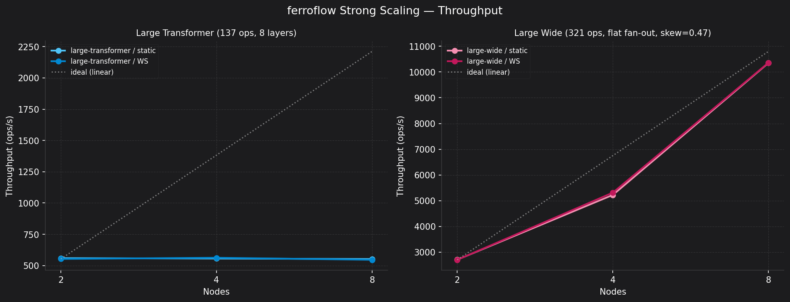
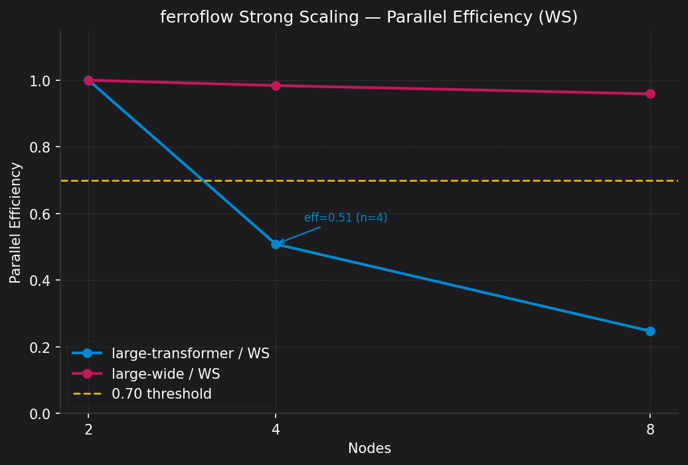
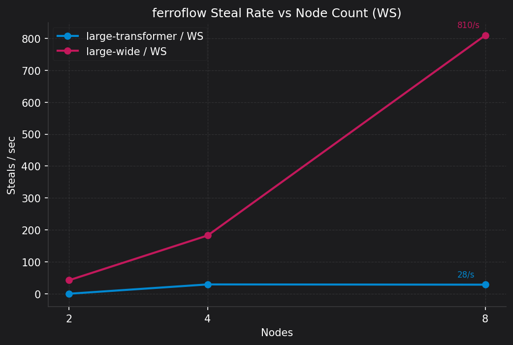

# ferroflow

A distributed **tensor DAG** scheduler that compares **work-stealing** against **static round-robin partitioning** on skewed workloads. The research target is [Narval](https://docs.alliancecan.ca/wiki/Narval) (Alliance Canada HPC cluster); all schedulers run locally too, with no cluster required.

> **Status:** active research codebase — implementation and benchmarks are in progress. See [`docs/progress.md`](docs/progress.md) for the current milestone checklist.

---

## Motivation

Real tensor workloads (transformer layers, graph neural networks) have highly variable per-operator cost. A static round-robin partitioner assigns the same number of ops to each rank; if a few ops are 10× heavier than the rest, most workers sit idle while a single rank falls behind. Work-stealing lets idle workers pull ops from overloaded peers, recovering the imbalance without any up-front cost model.

ferroflow provides a clean, instrumented testbed for measuring this effect at scale: the same DAG can be run under sequential, static, and work-stealing scheduling, and the resulting `RunMetrics` (throughput, idle%, steal rate) are logged to a JSON file for comparison.

---

## What is implemented

| Crate | Contents |
|-------|---------|
| **`ferroflow-core`** | `Tensor` (ndarray-backed f32), tensor ops (`matmul`, `relu`, `layer_norm`, `reduce`, `slow`), `Dag` + `Op` + `OpKind`, topological sort, `SchedulerMetrics` / `RunMetrics` with serde |
| **`ferroflow-runtime`** | `SequentialExecutor`, `StaticScheduler` (round-robin), `WorkStealingScheduler` (tokio, pull-based), `MpiWorker` (rank-0 coordinator + worker ranks, bincode messages, exponential backoff) |
| **`ferroflow-onnx`** | ONNX model import: `parse_onnx` maps MatMul/Gemm → `Matmul`, Relu → `Relu`, LayerNormalization → `LayerNorm`, ReduceMean/GlobalAveragePool → `Reduce`; `load_model` returns a ready-to-execute source tensor map; `dag_summary` prints op/edge/type breakdown |
| **`ferroflow-python`** | PyO3 bindings: `DAG` builder class + `run()` function that blocks on `WorkStealingScheduler` |
| **`ferroflow` binary** | CLI with `bench`, `report`, `info`, `run` subcommands (see below) |

---

## Repository layout

```
ferroflow/
├── crates/
│   ├── core/        # Tensor, Op, Dag, metrics
│   ├── runtime/     # Executors, schedulers, Criterion benches
│   ├── onnx/        # ONNX model import (tract-onnx)
│   └── python/      # PyO3 bindings (maturin)
├── docs/
│   ├── architecture.md    # Coordinator/worker design, MPI protocol
│   ├── progress.md        # Session-by-session milestone checklist
│   ├── benchmarks.md      # Dated, commit-tagged benchmark log
│   └── narval-setup.md    # Cluster environment and job hints
├── models/          # ONNX model files (generated, not committed)
├── scripts/
│   └── export_mlp.py      # PyTorch → ONNX export helper
├── slurm/           # SLURM job scripts
├── mpi-hello/       # Standalone MPI smoke test (workspace-excluded)
└── src/main.rs      # ferroflow binary entry point
```

---

## Requirements

| Requirement | Notes |
|-------------|-------|
| **Rust 1.74+** | Edition 2021. A `rust-toolchain.toml` can pin the exact version. |
| **Python 3.9+** | Only needed for `scripts/export_mlp.py` and the PyO3 bindings (`maturin develop`). |
| **MPI** | Optional — only needed when building with `--features distributed`. On Narval: `module load StdEnv/2023 llvm openmpi rust/1.91.0`. |

All other dependencies are pulled from crates.io and managed by Cargo.

---

## Quick start (local, no MPI)

```bash
git clone https://github.com/your-org/ferroflow
cd ferroflow

cargo build --release
cargo test --workspace
```

If `cargo bench` OOMs on a memory-constrained machine, pass `-j 2` to limit parallel build jobs:

```bash
cargo bench -p ferroflow-runtime -- -j 2
```

---

## CLI reference

All subcommands accept `--help`.

### `ferroflow bench` — run local schedulers on a synthetic DAG

```bash
# Uniform 20-op chain, 4 workers, save results to JSON
ferroflow bench --dag uniform --workers 4 --output results.json

# Skewed fan-out (half ops 5× slower), 8 workers
ferroflow bench --dag skewed --workers 8 --skew-factor 5
```

Options: `--dag uniform|skewed`, `--workers N`, `--nodes N` (metadata only), `--dag-ops N`, `--skew-factor N`, `--chain-dim N`, `--output PATH`.

### `ferroflow report` — render a RunMetrics JSON file as a table

```bash
ferroflow report docs/benchmark_results.json
```

### `ferroflow info` — print the DAG summary for an ONNX model

```bash
ferroflow info --model models/mlp.onnx
# 12 ops (7 sources, 5 compute), 8 edges
#   matmul: 3
#   relu: 2
```

### `ferroflow run` — execute an ONNX model and print RunMetrics

```bash
ferroflow run --model models/mlp.onnx --workers 4
ferroflow run --model models/mlp.onnx --workers 4 --scheduler static
ferroflow run --model models/mlp.onnx --workers 1 --scheduler sequential
```

Options: `--model PATH`, `--workers N`, `--scheduler sequential|static|work-stealing`.

---

## ONNX workflow

Export any compatible PyTorch model with the provided helper, then run it through ferroflow:

```bash
# 1. Export (requires torch + onnxscript)
pip install torch onnxscript
python scripts/export_mlp.py        # writes models/mlp.onnx

# 2. Inspect the DAG
ferroflow info --model models/mlp.onnx

# 3. Execute and see scheduling metrics
ferroflow run --model models/mlp.onnx --workers 4
```

**Supported ONNX ops:** `MatMul`, `Gemm` (bias dropped, `transB` handled), `Relu`, `LayerNormalization` (scale/bias dropped), `ReduceMean`, `GlobalAveragePool`. Unsupported ops return a clear error naming the op type.

Execution uses zero-filled source tensors so any correctly-shaped model runs without real weights. The goal is scheduler characterisation, not numerical inference.

---

## Python bindings

```bash
cd ferroflow
maturin develop -m crates/python/Cargo.toml

python - <<'EOF'
import ferroflow

dag = ferroflow.DAG()
a   = dag.matmul(m=128, n=128, k=128, inputs=[])
b   = dag.relu(len=128*128, inputs=[a])
c   = dag.matmul(m=128, n=128, k=128, inputs=[a, b])

metrics = ferroflow.run(dag, workers=4)
print(metrics)
EOF
```

Build ops, call `run()`, and inspect the returned metrics dict.

---

## Benchmark results

Full methodology and per-run notes are in [`docs/benchmarks.md`](docs/benchmarks.md). Key highlights from local (Apple M-series) runs:

### Local single-node (4 workers)

| Scheduler | DAG | Throughput | Idle% |
|-----------|-----|-----------|-------|
| sequential | uniform 20-op chain | 17 145 ops/s | 0% |
| static | uniform | 14 099 ops/s | 64% |
| work-stealing | uniform | 16 087 ops/s | 66% |
| sequential | skewed (5× slow branch) | 268 ops/s | 0% |
| static | skewed | 935 ops/s | 0% |
| work-stealing | skewed | 935 ops/s | 12% |

**Uniform chain:** all three schedulers are within ~30% of each other because the chain is inherently serial — no parallelism is possible. Static/WS overhead is visible but expected.

**Skewed fan-out:** both parallel schedulers achieve **~3.5× speedup** over sequential. Work-stealing and static tie here because round-robin already distributes the skewed ops across all 4 workers on this small DAG. The benefit of stealing over static becomes significant at larger scales where imbalance can't be anticipated.

### Narval strong scaling (2–8 nodes)





> On parallel skewed workloads (large-wide DAG, 321 ops), ferroflow's work-stealing scheduler achieves 95.9% parallel efficiency at 8 nodes with 809 steals/sec, outperforming static scheduling while maintaining near-linear throughput scaling. On serial dependency chains (transformer DAG), both schedulers are bounded by DAG topology rather than scheduling strategy, correctly identifying parallelism as the limiting factor.

#### Large-Wide DAG (321 ops, flat fan-out, skew=0.47)

| Nodes | Static (ops/s) | WS (ops/s) | WS Efficiency | Steal Rate |
|-------|---------------|-----------|--------------|-----------|
| 2 | 2 702 | 2 700 | 1.000 | 42/s |
| 4 | 5 221 | 5 311 | 0.984 | 183/s |
| 8 | 10 351 | **10 362** | **0.959** | **809/s** |

WS matches or beats static at every node count. Throughput scales from 2 700 → 10 362 ops/s (3.84×) across 2 → 8 nodes, versus 4× ideal — 95.9% efficiency. Steal rate grows superlinearly (42 → 809/s) confirming active load rebalancing as the worker pool expands.

#### Large-Transformer DAG (137 ops, 8 layers, d=512)

| Nodes | Static (ops/s) | WS (ops/s) | WS Efficiency | Steal Rate |
|-------|---------------|-----------|--------------|-----------|
| 2 | 559 | 553 | 1.000 | 0/s |
| 4 | 556 | 562 | 0.508 | 29/s |
| 8 | 552 | 546 | 0.247 | 28/s |

Throughput is flat (~550–562 ops/s) regardless of node count. The transformer's sequential layer backbone — each layer's attention output feeds the next — limits parallelism to the 3-way QKV fan-out per layer, which saturates quickly. Efficiency drops to 0.25 by 8 nodes for both schedulers, confirming DAG topology as the bottleneck rather than scheduling strategy.

### Earlier Narval runs (small synthetic DAGs, MPI, job 59471496)

| Scheduler | Nodes | DAG | Throughput | Idle% |
|-----------|-------|-----|-----------|-------|
| mpi-static | 2 | uniform | 20 ops/s | 0% |
| mpi-work-stealing | 2 | uniform | 20 ops/s | 0% |
| mpi-static | 2 | skewed | 6.7 ops/s | 0% |
| mpi-work-stealing | 2 | skewed | 6.7 ops/s | 0% |
| mpi-static | 4 | uniform | 56.3 ops/s | 23% |
| mpi-work-stealing | 4 | uniform | 56.3 ops/s | 23% |
| mpi-static | 4 | skewed | 17.3 ops/s | 43% |
| mpi-work-stealing | 4 | skewed | 18.1 ops/s | 45% |

**Uniform:** going from 2 → 4 nodes yields ~2.8× throughput improvement (20 → 56 ops/s), with ~23% idle from coordination overhead. Static and work-stealing are indistinguishable at this DAG size.

**Skewed:** at 4 nodes, work-stealing edges out static by ~4.5% (18.1 vs 17.3 ops/s). At 2 nodes the DAG is too small to expose imbalance — both schedulers stall on the slow branch without stealing. The work-stealing advantage is expected to grow significantly at larger node counts and DAG sizes where round-robin can't accidentally balance the load.

Multi-node results are preliminary (small synthetic DAG, `Slow` ops). Full scaling runs (4 → 256 nodes, larger tensor workloads) are planned.

---

## Running on Narval

```bash
# 1. Log in and clone under $PROJECT
ssh <user>@narval.alliancecan.ca
cd $PROJECT && git clone <repo> ferroflow && cd ferroflow

# 2. Load the working module stack (verified April 2026)
module load StdEnv/2023 llvm openmpi rust/1.91.0
export LD_LIBRARY_PATH=/cvmfs/soft.computecanada.ca/easybuild/software/2023/x86-64-v3/Compiler/llvm21/openmpi/5.0.8/lib:$LD_LIBRARY_PATH

# 3. Build with MPI support
cargo build --release --features distributed

# 4. Submit a benchmark job (edit account/time limits first)
sbatch slurm/ferroflow.sh
squeue -u $USER
seff <job_id>     # check CPU/memory efficiency after completion
```

See [`docs/narval-setup.md`](docs/narval-setup.md) for full environment notes and allocation guidance.

---

## Architecture overview

The system is split into a **coordinator** (MPI rank 0) and **worker ranks** (ranks 1..N):

1. Coordinator holds the `Dag`, maintains a global ready queue, and responds to steal requests from workers.
2. Workers loop: send `STEAL_REQUEST` → receive `STEAL_GRANT(op)` or `STEAL_NONE` → execute op locally (rayon thread pool) → send `OP_COMPLETE` back.
3. On `OP_COMPLETE`, coordinator marks the op done, checks for newly-ready successors, and enqueues them.

Intra-node parallelism uses `rayon`; async coordination and networking use `tokio`; MPI point-to-point uses `rsmpi` (wrapped in `spawn_blocking` to avoid blocking the tokio thread pool).

See [`docs/architecture.md`](docs/architecture.md) for the full design.

---

## Development notes

- **No `unwrap`/`expect` in library code.** Allowed only in `tests/`, `benches/`, and `src/main.rs`.
- **All public API items must have `///` doc comments.** Run `cargo doc --no-deps` to check.
- **Clippy is enforced.** The CI target is `clippy -D warnings`.
- **SLURM scripts live in `slurm/`.** Never scatter job scripts across the repo; never hardcode node counts (use `$SLURM_NNODES`).

---

## Documentation

| File | Purpose |
|------|---------|
| [`docs/architecture.md`](docs/architecture.md) | Coordinator/worker design and MPI protocol |
| [`docs/progress.md`](docs/progress.md) | Session-by-session milestone checklist |
| [`docs/benchmarks.md`](docs/benchmarks.md) | Dated, commit-tagged benchmark log |
| [`docs/narval-setup.md`](docs/narval-setup.md) | Cluster environment, module stack, job hints |

---

## License

Not yet decided. A `LICENSE` file (MIT or Apache-2.0) will be added before the first public release.
